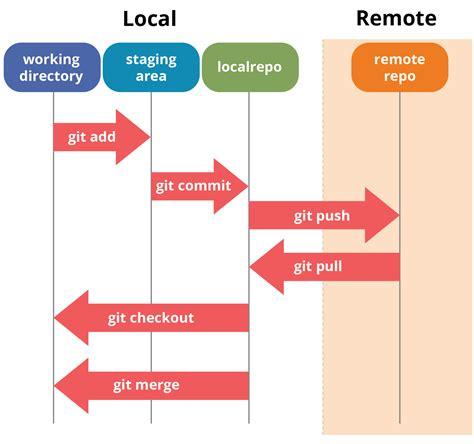

# Git concept

A picture is worth a thousand words.

Credit to [edureka.co](https://www.edureka.co/blog/git-tutorial/)

# အသုံ:၀င်သော Git command မျာ:

## ၁။ အခြေခံ command

#### Git Project (သို့) repository ကို clone လုပ်နည်း
> `git clone <repository>`

#### Local မှာရှိသော branch တခုမှ branch တစ်ခုသို့ပြောင်:နည်း
> `git checkout <branchname>`

#### Git branch ကိုတခြားအမည်ဖြစ် checkout လုပ်နည်း
> `git checkout -b <branchnameအသစ်> <remote_branch>`
>> ##### ဥပမာ:
>> `git checkout -b feature/myfeature origin/dev`

#### Git repository ကနေနောက်ဆုံး branch အသစ်တွေကို fetch လုပ်နည်း
> `git fetch -p`
>> *`-p`: prune (merged လုပ်ပြီးသော branch ကိုဖြတ်တောက်ပေ:တယ်)

#### Git pull
> `git pull`

#### Stage မလုပ်ခင်အပြောင်းအလဲရှိသောဖိုင်များကိုကြည့်နည်း
> `git status` (သို့) `git status -u` 
>> *`-u`: untracked file (git ကအသိအမှတ်မပြုသေးသောဖိုင်(သို့)ဖိုင်အသစ်)

#### Stage file (git commit မလုပ်ခင်ဖိုင်တစ်ခုကို stage လုပ်နည်း)
> `git add <filename>`

#### Stage all file (အပြောင်:အလဲလုပ်ထာ:သောဖိုင်အားလုံ:ကို stage လုပ်နည်း)
> `git add .`

#### Git commit လုပ်နည်း
> `git commit -m "first commit message"`

#### Git commit လုပ်ပြီး(push မလုပ်ခင်)၊ commit message ကိုပြန်ပြင်နည်း
> `git commit --amend -m "correct commit message"`

#### Local branch အသစ်ကို Git repository ပေါ်တင်နည်း (သို့) checkout လုပ်ထားသော repository သို့ push နည်း
> `git push origin <branchname>` 

#### Remote & Local branch အားလုံးကိုကြည့်နည်း
> `git branch -a`

---

## ၂။ လက်တွေ့အသုံးများသော command များ

#### ဖိုင်တွေကိုမပြုပြင်ခင်အခြေအနေသို့ပြန်လုပ်နည်း (အပြောင်းအလဲကို discard လုပ်ချင်သောအခါ)
> `git checkout -- .`

#### အရင် branch တစ်ခုသို့​ပြန် switch နည်း
> `git checkout -`

#### Local မှ track နေသော remote branch ကိုပြောင်းနည်း
> `git branch -u <remote_branchname>`
>> `-u`: upstream(remote)

#### File reset/unstage လုပ်နည်း (undo git add)
> `git reset HEAD <filename>`

#### Commit reset လုပ်နည်း
> `git reset --hard HEAD`

#### လက်ရှိ Commit ID ၏ရှေ့ commit သို့ပြန်သွားနည်း
> `git reset HEAD~2` (ဥပမာ၊ ရှေ့ commit နှစ်ခုမြောက်သို့)

#### Git reset လုပ်ပြီးသောအခါ Git commit id ပြန်ရှာနည်း
> `git reflog`
>
> ##### reflog: reference log ကိုဆိုလိုသည်

#### Local မှာရှိသော untracked file ကိုဖျက်ခြင်း
> Step 1: `git clean -n` (အရင်ဆုံးဖျက်မည့်ဖိုင်ကို list လုပ်ပြီး)
>
> Step 2: `git clean -f` (ဖိုင်ကို delete လုပ်)
>
> **Note:** directory/folder ကိုဖျက်လိုလျှင် `git clean -f -d`

#### မှားယွင်းပြီး commit လုပ်ပြီး၊ Commit ကို revert လုပ်နည်း
> `git revert <commit_id>`

#### Git commit message log ကြည့်နည်း
> `git log --graph --oneline --decorate`

#### Local မှာ branch တွေများလာပြီ:၊ merged လုပ်ပြီးသော branch များကိုရှင်းချင်သောအခါ
> `git branch --merged | egrep -v "(^\*|master|dev)" | xargs git branch -d`
>> `git branch --merged` : merged လုပ်ပြီးသော branch များကို list လုပ်
>>
>> `egrep -v "(^\*|master|dev)"` : master & dev branch ကို exclude လုပ်
>>
>> `xargs git branch -d` : master & dev branch အပြင်၊ လက်ကျန် branch ကို delete လုပ်

---

## ၃။ မှတ်စု

#### `git reset` နဲ့ `git revert` ၏ကွာခြားချက်
> `git reset` နဲ့ `git revert` နှစ်ခုလုံးကမှားယွင်းပြီး git commit လုပ်မိသောအခါ (သို့) commit အဟောင်းသို့ပြန်သွားချင်သောအခါသုံးသော command ဖြစ်ပြီး၊
>
> `git reset` က commit history/id ကိုမသိမ်းပေးသောကြောင့် local တွင်သာအသုံးပြုသင့်ပါတယ်။
>
> `git revert` ကတော့ commit history/id ကိုသိမ်းပေးသည့်အတွက် commit history/id ကိုချန်ထားရန်လိုအပ်သောအခါမျိုးမှာသုံးသင့်ပါတယ်။

---

## Comming soon
- Cherry Pick
- Git Rebase

